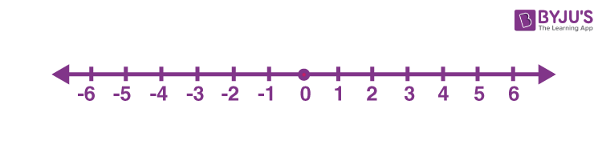

# Math Notes - Episode 1  <!-- omit in toc -->
## Vector & Dot products <!-- omit in toc -->

### Based on [Freya Tutorial](https://www.youtube.com/watch?v=MOYiVLEnhrw&t=363s) <!-- omit in toc -->

Hey there. I decided to start a new passion for Maths :').  
Here are some notes taken on a base material offered to us by the great **[Freya Holmer](https://twitter.com/FreyaHolmer?ref_src=twsrc%5Egoogle%7Ctwcamp%5Eserp%7Ctwgr%5Eauthor)**.

Those **personnal notes** will follow the video timestamps.

### Content <!-- omit in toc -->
- [Why Maths ?](#why-maths-)
- [1D Vectors (a.k.a Scalar, Floats, Numbers)](#1d-vectors-aka-scalar-floats-numbers)
- [2D Vectors](#2d-vectors)
- [Vector normalization](#vector-normalization)
- [Direction to point](#direction-to-point)
- [Length](#length)
- [Distance](#distance)
- [Point along a direction](#point-along-a-direction)
- [Radial Trigger](#radial-trigger)
- [Dot Product](#dot-product)
- [Assignements ?](#assignements-)
- [Personnal Maths Notes](#personnal-maths-notes)

___
### Why Maths ?
So... I decided to focus more myself on math after rewatching the whole [Astortion's Devlog](https://www.youtube.com/watch?v=4hF0lYZQVcg&list=PLh0j6fxciWbLVMwgAGx6UprZZQGvD-cYG) by [aarthificial](https://twitter.com/aarthificial).
Recently, he linked a [video](https://www.youtube.com/watch?v=KPoeNZZ6H4s) about **Procedural Animations** from [t3ssel8r](https://twitter.com/t3ssel8r) which impressed me a lot. I've seen this kind of work before, but those guys approch it from an analytical perspective and an elegant equation solving manner.

That was enought to get me started. I've already a bunch of ressources on **Game Dev Maths** which I'll probably link and store there one day. But for now on, let's start with *freya's stuff*.

___
### 1D Vectors (a.k.a Scalar, Floats, Numbers)
We start working with *"one dimension vectors"* because the same principles apply to higher dimension vectors.

In one dimension, the numbers are treated as *float*, *scalar* or *single value*.  

This is a number line :

- It lies in one dimensional space
- It help visualize integers and space in between (floating points)
- Range from [-$\infty$, +$\infty$]

Here numbers can be considered as *vectors*, *distance from origins*, *steps*...  
> They acts as the *representation of something*, and within the same context, numbers can be interpreted in multiples ways.

They can be treated in the same manner than higher dimensional vectors:
- Length (always positive) | Can be called 
**magnitude**
  ```C#
    # x is a one dimension vector
    abs(x) = length # > 0
  ```
- Direction (-1 or 1) | Called **sign** in one dimension
    ```C#
    # x is a one dimension vector
    sign(x) = 1, -1 or error
    ```
- Distance (Signed Distance exists aswell !)
    ```C#
    # a and b are one dimension vectors
    dist(a, b) = |a - b| (or |b - a|)
    dist(a,b) = abs(a - b)
    dist(a,b) = abs(b - a)
    #...
    ```
- Addition (or Substraction)  


> In this context :
> - Addition is an offset
> - Multiplication is a scale

With this basic knowledge, let's move one dimension higher !
___
### 2D Vectors
___
### Vector normalization
___
### Direction to point
___
### Length
___
### Distance
___
### Point along a direction 
___
### Radial Trigger
___
### Dot Product
___
### Assignements ?
___
### Personnal Maths Notes
- Basics
  > Addition to Substraction : $a+b = a + (-b)$

  > Multiply to Divide : $^a/_b = a.(^1/_b)$


